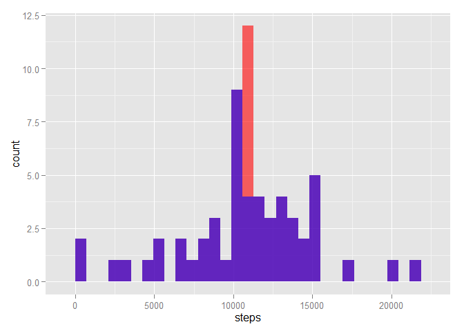
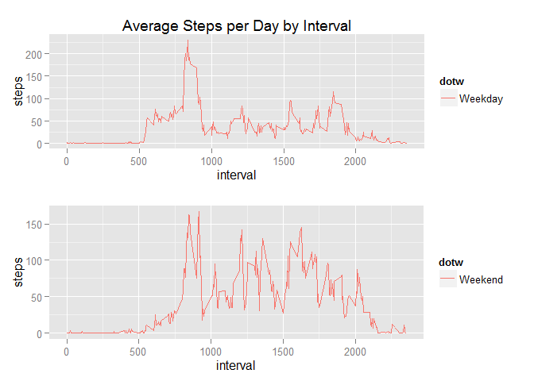

# Reproducible Research: Peer Assessment 1

##Loading and preprocessing the data

In the file containing your cloned fork of the RepData repo, unzip *activity.zip*, then load the data to `data`

```r
data <- read.csv("activity.csv")
```

##What is mean total number of steps taken per day?

####Make a histogram of the total number of steps taken each day

```r
library(ggplot2)
steps_per_day <- aggregate(steps ~ date, data, sum)
qplot(steps, data=steps_per_day, geom="histogram")
```

```
## stat_bin: binwidth defaulted to range/30. Use 'binwidth = x' to adjust this.
```

 

####Calculate and report the mean and median total number of steps taken per day


```r
spdmean <- mean(steps_per_day$steps)
spdmedian <- median(steps_per_day$steps)
options(scipen=999)
```

The **mean** is **10766.1886792** and the **median** is **10765**.

##What is the average daily activity pattern?

####Make a time series plot (i.e. type = "l") of the 5-minute interval (x-axis) and the average number of steps taken, averaged across all days (y-axis)


```r
steps_mean_per_interval <- aggregate(steps ~ interval, data = data, FUN = mean)
p <- ggplot(steps_mean_per_interval, aes(x=interval, y=steps))
p + geom_line()
```

 

####Which 5-minute interval, on average across all the days in the dataset, contains the maximum number of steps?


```r
max_interval <- steps_mean_per_interval[which.max(steps_mean_per_interval$steps),1]
```

The 5-minute interval, on average across all the days in the dataset, containing the maximum number of steps is **835**.

##Imputing missing values

####Calculate and report the total number of missing values in the dataset


```r
sum(is.na(data))
```

```
## [1] 2304
```

####Create a new dataset that is equal to the original dataset but with the missing data filled in

The misssing data will be filled in by the mean value of steps per 5 min interval.


```r
imputed_data <- merge(data, steps_mean_per_interval, by = "interval", suffixes = c("", "_prime"))
nas <- is.na(imputed_data$steps)
imputed_data$steps[nas] <- imputed_data$steps_prime[nas]
imputed_data <- imputed_data[, c(1:3)]
head(imputed_data)
```

```
##   interval    steps       date
## 1        0 1.716981 2012-10-01
## 2        0 0.000000 2012-11-23
## 3        0 0.000000 2012-10-28
## 4        0 0.000000 2012-11-06
## 5        0 0.000000 2012-11-24
## 6        0 0.000000 2012-11-15
```

####Make a histogram of the total number of steps taken each day and Calculate and report the mean and median total number of steps taken per day. Do these values differ from the estimates from the first part of the assignment? What is the impact of imputing missing data on the estimates of the total daily number of steps?


```r
steps_per_day_prime <- aggregate(steps ~ date, imputed_data, sum)
steps_per_day_prime <- cbind(steps_per_day_prime, Data = "Imputed")
steps_per_day       <- cbind(steps_per_day      , Data = "Not Imputed")
steps_compar        <- rbind(steps_per_day_prime, steps_per_day)
p                   <- ggplot(steps_compar, aes(x=steps), groups = Data)
p + geom_histogram(data=subset(steps_compar,Data == "Imputed"),fill = "red", alpha = 0.6) + geom_histogram(data=subset(steps_compar,Data == "Not Imputed"),fill = "blue", alpha = 0.6) 
```

```
## stat_bin: binwidth defaulted to range/30. Use 'binwidth = x' to adjust this.
## stat_bin: binwidth defaulted to range/30. Use 'binwidth = x' to adjust this.
```

 


```r
mean(steps_per_day_prime$steps)
```

```
## [1] 10766.19
```

```r
median(steps_per_day_prime$steps)
```

```
## [1] 10766.19
```

Obviously, by replacing the missing data by the mean value of steps for every interval, the mean value of steps per day would stay the same, in this case, the median shifted and is now equal to the mean value (due to the large number of missing value that we started out with)

####Are there differences in activity patterns between weekdays and weekends?


```r
weekdays <- c("Monday", "Tuesday", "Wednesday", "Thursday", "Friday")
imputed_data$dotw = as.factor(ifelse(is.element(weekdays(as.Date(imputed_data$date)),weekdays), "Weekday", "Weekend"))
smpip <- aggregate(steps ~ interval + dotw, imputed_data, mean) #steps mean per interval from imputed data

p1 <- ggplot(smpip[smpip$dotw=="Weekday",], aes(x=interval, y=steps, group=dotw, colour=dotw)) + geom_line() + ggtitle("Average Steps per Day by Interval")
p2 <- ggplot(smpip[smpip$dotw=="Weekend",], aes(x=interval, y=steps, group=dotw, colour=dotw)) + geom_line()

multiplot <- function(..., plotlist=NULL, file, cols=1, layout=NULL) {
  require(grid)

  # Make a list from the ... arguments and plotlist
  plots <- c(list(...), plotlist)

  numPlots = length(plots)

  # If layout is NULL, then use 'cols' to determine layout
  if (is.null(layout)) {
    # Make the panel
    # ncol: Number of columns of plots
    # nrow: Number of rows needed, calculated from # of cols
    layout <- matrix(seq(1, cols * ceiling(numPlots/cols)),
                    ncol = cols, nrow = ceiling(numPlots/cols))
  }

 if (numPlots==1) {
    print(plots[[1]])

  } else {
    # Set up the page
    grid.newpage()
    pushViewport(viewport(layout = grid.layout(nrow(layout), ncol(layout))))

    # Make each plot, in the correct location
    for (i in 1:numPlots) {
      # Get the i,j matrix positions of the regions that contain this subplot
      matchidx <- as.data.frame(which(layout == i, arr.ind = TRUE))

      print(plots[[i]], vp = viewport(layout.pos.row = matchidx$row,
                                      layout.pos.col = matchidx$col))
    }
  }
}
##################################################################################

multiplot(p1, p2)
```

```
## Loading required package: grid
```

 

The highest peak is during weekdays somewhere in the day, but overall, there's more activity on weekends.
